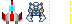

> This article is in-development and will be released in full form soon. It'll appear on Medium (my publisher likes that), with this as a the accompanying Github repo.

# Bevy-Invaders

About the time that *Hands-on Rust* emerged from its technical review, the Rust game development world was abuzz with news of a new engine: *Bevy*. It was too late to incorporate Bevy into my book--but it looked like a great engine. Bevy has now been available for a year, and is rapidly improving--and capturing mind-share amongst Rust users.

Bevy is a good fit for *Hands-on Rust* readers. It's Entity-Component System based, easy to use, and supports everything you need to make simple games.

Let's take Bevy for a test-drive. We'll make a simple *Space Invaders* game in under 200 lines of code.

## Creating a New Project

Find your usual Rust project folder, and create a new project by typing `cargo new bevy_test` into your terminal. You need to edit `Cargo.toml` to include the Bevy engine:

```toml
[package]
name = "bevytest"
version = "0.1.0"
edition = "2018"

[dependencies]
bevy = "0.5"
```

Bevy doesn't require any additional dependencies--so you're good to go.

## Programmer Art Time

Our simple *Space Invaders* game will use 3 graphics: the player's spaceship (which I sketched in The Gimp), a bug monster (from [OpenGameArt](https://opengameart.org/content/some-invaders) - by Matriax) and a laser burst (also made in The Gimp).

Each is 24x24 pixels in size, and has a transparent background. I combined them onto a "sprite sheet" as follows:



Notice that the sprites are 24 pixels apart, on the same row. This makes it easy to index them. This file belongs in a new folder named `assets`, off of the project directory.

## Initializing a Window

Open your `main.rs` file, and let's change the `main` function to create a Bevy application and open a window:

```rust
use bevy::prelude::*;

fn main() {
    App::build()
        .insert_resource(WindowDescriptor {
            title: "Bevy Invaders".to_string(),
            width: 640.0,
            height: 480.0,
            vsync: true,
            ..Default::default()
        })
        .add_plugins(DefaultPlugins)
        .run();
}
```

You start out by including Bevy's prelude. This provides everything you will need. The `App::build()` system uses a *builder* pattern---just like `bracket-lib` in *Hands-on Rust*. You insert a `WindowDescriptor`, making a 640x480 window with a title. Then you add the default plugins from Bevy---this includes everything you need to make a basic game.

Running your program now opens a 640x480 grey window.

## Loading Sprites

Bevy takes the *systems* concept used in *Hands-on Rust* to another level. You don't pass control to your own game loop at all---you give Bevy systems to run, and it executes them. The first type of system you will use is a "Startup System", one that runs when the application starts.

Let's add a startup system to `main.rs`:

```rust
fn setup(
    mut commands: Commands,
    asset_server: Res<AssetServer>,
    mut texture_atlases: ResMut<Assets<TextureAtlas>>,
) {
    // Setup the sprite sheet
    let texture_handle = asset_server.load("spritesheet.png");
    let texture_atlas = TextureAtlas::from_grid(texture_handle, Vec2::new(24.0, 24.0), 3, 1);
    let texture_atlas_handle = texture_atlases.add(texture_atlas);

    // Add a 2D Camera
    commands.spawn_bundle(OrthographicCameraBundle::new_2d());

    // Spawn the player
    commands.spawn().insert_bundle(SpriteSheetBundle {
        texture_atlas: texture_atlas_handle.clone(),
        transform: Transform::from_translation(Vec3::new(0.0, -220.0, 0.0)),
        sprite: TextureAtlasSprite::new(0),
        ..Default::default()
    });
}
```

The function header has 3 parameters. Don't worry, the contents is injected automatically---you don't need to worry about filling them up. Let's take a look at the parameters:

* `mut commands : Commands` requests a command buffer, just like the command buffers you used with Legion in *Hands-on Rust*. You'll use this to spawn entities.
* `asset_server: Res<AssetServer>` is requesting a *resource* (just like the Legion resources you used in my book). It's requesting a built-in resource, an "asset server". This serves as a centralized repository of all of the assets---game graphics, sounds, etc.---that your game will use.
* `mut texture_atlases: ResMut<Assets<TextureAtlas>>` is another resource, this time mutable. "Texture Atlasses" are sprite sheets---images containing all of your sprites.

Setting up your sprite sheet requires that you load the image into the asset server with `asset_server.load`. Then you create a new `texture_atlas`, specifying that you have 3 images, spaced 24 pixels apart on your sprite sheet. Finally, you obtain a "handle" - a means of specifying which sprite sheet you want and store it for later use.

`commands.spawn_bundle(OrthographicCameraBundle::new_2d());` creates a default 2D camera. Since the game is 2D, this is exactly what you need. The only difference from other cameras is that `0,0` is the *center* of your screen---so your 640x480 window actually ranges from -320 to 320 on the x axis, and -240 to 240 on the y axis.

Finally, we'll spawn a spaceship to make sure that the sprite system works. `commands.spawn()` adds a command to the queue to create a new entity. Subsequent functions add details to the entity; it's the builder pattern--but for entities and components.

In this case, we're adding a `SpriteSheetBundle`. This is a Bevy-provided bundle of components, specifying everything you need to render a sprite on the screen. You have to provide it with the texture atlas handle we made earlier, and a sprite index--0 in this case, the first sprite on the sprite sheet. The `transform` is a little more mysterious. Bevy sprites can be moved, scaled and rotated. We only want movement, so we call `Transform::from_translation(Vec3::new(0.0, -220.0, 0.0))` to spawn the spaceship at `0, -220`.

All that remains is to *use* your new `setup` function. In your `main` function, add it to the app builder:

```rust
fn main() {
    App::build()
        .insert_resource(WindowDescriptor {
            title: "Bevy Invaders".to_string(),
            width: 640.0,
            height: 480.0,
            vsync: true,
            ..Default::default()
        })
        .add_plugins(DefaultPlugins)
        .add_startup_system(setup.system())
        .run();
}
```

If you run the game now, you'll see a grey window with a spaceship in it.

## Moving the Player

We'll move the spaceship in response to the left and right arrows (you can change it by changing the code). We'll also reserve `spacebar` for firing your lasers--but we'll get to that later.

Let's start by adding a component to represent the player:

```rust
struct Player {
    delta_x: f32,
}
```

We already have the player's transformation attached to their sprite, so we'll use that for their current position. Simple "press button, move 1 pixel" movement feels sluggish and unintuitive, so we're going to use `delta_x` to represent the current movement rate of the player--and make keypresses represent acceleration.

Create a new function named `player`. This will handle all things relating to the player. Add the following code:

```rust
fn player(
    keyboard_input: Res<Input<KeyCode>>,
    mut commands: Commands,
    mut query: Query<(&mut Player, &mut Transform, &Handle<TextureAtlas>)>,
) {
    const ACCELERATION: f32 = 1.0;
    const MAX_VELOCITY: f32 = 16.0;

    for (mut player, mut trans, atlas_handle) in query.iter_mut() {
        let mut firing = false;

        if keyboard_input.pressed(KeyCode::Left) {
            player.delta_x -= ACCELERATION;
        }
        if keyboard_input.pressed(KeyCode::Right) {
            player.delta_x += ACCELERATION;
        }
        if keyboard_input.just_pressed(KeyCode::Space) {
            firing = true;
        }

        // Apply movement deltas
        player.delta_x = player.delta_x.clamp(-MAX_VELOCITY, MAX_VELOCITY);
        trans.translation.x += player.delta_x;
        trans.translation.x = trans.translation.x.clamp(-320.0, 320.0);

        // Decelerate
        player.delta_x *= 0.75;
    }
}
```

The function parameters will once again be injected by Bevy--you don't need to worry about populating them. The function is requesting:

* `keyboard_input: Res<Input<KeyCode>>,`, a resource containing current keyboard input. Bevy provides this automatically.
* `mut commands: Commands,`, an ECS command buffer. You won't be using this yet, but keep it around for later.
* `mut query: Query<(&mut Player, &mut Transform, &Handle<TextureAtlas>)>,` is an ECS query. It's very similar to the Legion queries you wrote in *Hands-on Rust*. You want the query to iterate entities that have a `Player` component, a `Transform` (for current position) and a `Handle<TextureAtlas>`. The latter provides a way to access the sprite-sheet. You won't need it yet, we'll need it when we start shooting things.

Next, we define some constants. I played with these values until they felt right to me. Feel free to adjust. `ACCELERATION` provides the rate-of-change to the X-axis when a movement key is pressed. `MAX_VELOCITY` acts as a limiter--the ship won't move faster than this many pixels per frame.

We then iterate the query. This will run once for each entity which has all of the components we listed in the query--just like a Legion query. Since we only have one `Player`, we can be sure it will only run once.

Within the query, we check `keyboard_input.pressed` to see if different keys are pressed. If the left movement arrow key is pressed, we reduce the player's `delta_x` by `ACCELERATION`--we do the inverse if the right arrow key is pressed. We also set `firing` to `true` if the spacebar is pressed, but we won't worry about that yet.

The section commented "apply the movement delta" uses `clamp` to ensure that acceleration is within the range `-MAX_VELOCITY .. MAX_VELOCITY`--the player can't exceed the speed limit. It then adds `delta_x` to the player's x translation--moving the player. Finally, it clamps once again to ensure that the player remains on the screen.

The last command gradually reduces `delta_x` over time. The ship will gradually slide to a halt. This isn't entirely realistic in space, but it's intuitive to players--and common in this type of game.

The last thing you need to do is add `player` to the list of systems you run in `main.rs`:

```rust
fn main() {
    App::build()
        .insert_resource(WindowDescriptor {
            title: "Bevy Invaders".to_string(),
            width: 640.0,
            height: 480.0,
            vsync: true,
            ..Default::default()
        })
        .add_plugins(DefaultPlugins)
        .add_startup_system(setup.system())
        .add_system(player.system())
        .run();
}
```

Run the game now. You can move your player left and right. Movement is smooth, with acceleration and apparent friction. Not bad for 75 lines of code!

## Adding Bugs

Adding bugs to code is easy. Fortunately, adding intentional invader bugs isn't too hard either. We want to create a few rows of alien bug-monsters, cycling left or right and moving down a row when they reach the edge of the screen. Fortunately, this isn't too hard to accomplish.

### Buggy Data

We'll start by codifying the bug's movement in an `enum` and component type:

```rust
enum BugMovement {
    Left,
    Right,
    Down { n: f32, next_left: bool },
}

struct Bug {
    movement: BugMovement,
}
```

We're deriving `Copy` and `Clone` because we'll need to make copies of the AI state later on. Otherwise, this is very standard Rust: a bug is either moving left, right or down. If its moving down, we track how far down it has moved. Then we store a `movement` entry in a structure to act as the bug's AI component.

### Moving the Bugs

We'll create another system to move the bugs. Create a new function as follows:

```rust
fn bug_movement(mut query: Query<(&mut Bug, &mut Transform)>) {
    for (mut bug, mut trans) in query.iter_mut() {
        let mut new_movement = bug.movement;
        match bug.movement {
            BugMovement::Left => {
                trans.translation.x -= 2.0;
                if trans.translation.x < -300.0 {
                    new_movement = BugMovement::Down {
                        n: 12.0,
                        next_left: false,
                    };
                }
            }
            BugMovement::Right => {
                trans.translation.x += 2.0;
                if trans.translation.x > 300.0 {
                    new_movement = BugMovement::Down {
                        n: 12.0,
                        next_left: true,
                    };
                }
            }
            BugMovement::Down { n, next_left } => {
                trans.translation.y -= 2.0;
                new_movement = BugMovement::Down {
                    n: n - 1.0,
                    next_left,
                };
                if n < 1.0 {
                    new_movement = if next_left {
                        BugMovement::Left
                    } else {
                        BugMovement::Right
                    };
                }
            }
        }
        bug.movement = new_movement;
    }
}
```

The logic should be easy enough to follow here. We're iterating through every bug in the system and moving it left or right. If it reaches the edge of the screen, we change its mode to `Down`--and set `n` to 12, indicating that it may move down 12 times. If a bug is moving downwards, we move it down and increase `n`.

### Spawning some Bugs

Next, we need to extend our `setup` function to create some bugs. Add this after you finish creating the player in `setup`:

```rust
// Spawn rows of enemies
for bug_row in 0..4 {
    let y = 200.0 - (bug_row as f32 * 30.0);
    for bug_col in 0..20 {
        let x = -300.0 + (bug_col as f32 * 30.0);
        commands
            .spawn()
            .insert_bundle(SpriteSheetBundle {
                texture_atlas: texture_atlas_handle.clone(),
                transform: Transform::from_translation(Vec3::new(x, y, 0.0)),
                sprite: TextureAtlasSprite::new(1),
                ..Default::default()
            })
            .insert(Bug {
                movement: if bug_row % 2 == 0 {
                    BugMovement::Left
                } else {
                    BugMovement::Right
                },
            });
    }
}
```

We create 4 rows of bugs, and 20 bugs per row. The bugs are nicely spaced apart, and alternating rows are either moving left or right.

All that remains is to add our new system to our `main` function:

```rust
fn main() {
    App::build()
        .insert_resource(WindowDescriptor {
            title: "Bevy Invaders".to_string(),
            width: 640.0,
            height: 480.0,
            vsync: true,
            ..Default::default()
        })
        .add_plugins(DefaultPlugins)
        .add_startup_system(setup.system())
        .add_system(player.system())
        .add_system(bug_movement.system())
        .run();
}
```

Run the program now, and you have waves of bugs working their way down towards the player. There's no way to defend yourself yet, but it's a great start!

## Zapping Bugs

Firing at bugs is the core of *Space Invaders* type game-play, so let's implement that. We'll start by creating an empty component (a "tag") to indicate that an entity is in fact a laser blast:

```rust
struct Laser;
```

Remember the `firing` variable in your `player` function? We'll add some code to spawn a new laser blast above the player when the spacebar is pressed. Add this code to the end of the `player` function (inside the query loop):

```rust
if firing {
    commands
        .spawn()
        .insert_bundle(SpriteSheetBundle {
            texture_atlas: atlas_handle.clone(),
            transform: Transform::from_translation(Vec3::new(
                trans.translation.x,
                trans.translation.y + 24.0,
                0.0,
            )),
            sprite: TextureAtlasSprite::new(2),
            ..Default::default()
        })
        .insert(Laser {});
}
```

This is very similar to the entity spawning from the `setup` function. It spawns a laser blast just above the player.

### Moving Lasers

Ideally, laser blasts should shoot upwards--and remove themselves from the game when they hit the top of the screen. Let's make a simple system for this. Add the following function:

```rust
fn laser_movement(mut query: Query<(Entity, &Laser, &mut Transform)>, mut commands: Commands) {
    for (entity, _, mut trans) in query.iter_mut() {
        trans.translation += Vec3::new(0.0, 4.0, 0.0);

        if trans.translation.y > 240.0 {
            commands.entity(entity).despawn();
        }
    }
}
```

The only new concept here is that we check for `y` hitting the edge of the screen--and remove the laser blast if it did. In the query, notice we include `Entity`; this includes a unique identifier for the laser blast we are examining in the query. We access it via the `commands.entity(entity)` function--and add the command `despawn`, which deletes the entity from the game.

You need to insert the `laser_movement` system into your `main` function's app builder:

```rust
...
.add_system(laser_movement.system())
.run();
```

If you run the game now, you can fire lasers--but you can't affect the bugs.

## Zapping Bugs

The last system we need removes bugs from the game if they are hit by laser fire. Add one more function to your game:

```rust
fn bug_zapper(
    laser_query: Query<(Entity, &Laser, &Transform)>,
    collider_query: Query<(Entity, &Bug, &Transform)>,
    mut commands: Commands,
) {
    for (entity, _, trans) in laser_query.iter() {
        let laser_pos = Vec2::new(trans.translation.x, trans.translation.y);
        for (bug_entity, _, bug_transform) in collider_query.iter() {
            let bug_pos = Vec2::new(bug_transform.translation.x, bug_transform.translation.y);

            if bug_pos.distance(laser_pos) < 24.0 {
                commands.entity(bug_entity).despawn();
                commands.entity(entity).despawn();
            }
        }
    }
}
```

This function is a little more complicated. Let's look at the parameters it requests from Bevy:

* `laser_query: Query<(Entity, &Laser, &Transform)>` creates a query that provides the entity and position of laser blasts.
* `collider_query: Query<(Entity, &Bug, &Transform)>` creates a query that lists the positions of bugs.
* `mut commands` once again gives you a command buffer with which you may remove entities.

The function iterates the `laser_query` first, running once per active laser blast. Inside the query, it:

* Stores the laser's current position in a `Vec2` type. This is not to be confused with `Vec` (the container)--it is a 2-entry vector. Bevy includes fast vector math functions.
* Runs the `collider_query` and for each bug position:
   * Store the bug's position in another `Vec2`.
   * Use the `distance` function, built into `Vec2` to calculate how far away each bug is from the laser.
   * If the bug is within 24 pixels, it removes both the bug and the laser blast from the ECS.

Once again, you need to add the new system to your `main` function's builder:

```rust
...
.add_system(laser_movement.system())
.add_system(bug_zapper.system())
.run();
```

Run the game now. You can move left and right, and shoot the ever encroaching waves of aliens.

## The Finished Program

The completed program weighs in at 198 lines of code:

```rust
use bevy::prelude::*;

fn main() {
    App::build()
        .insert_resource(WindowDescriptor {
            title: "Bevy Invaders".to_string(),
            width: 640.0,
            height: 480.0,
            vsync: true,
            ..Default::default()
        })
        .add_plugins(DefaultPlugins)
        .add_startup_system(setup.system())
        .add_system(player.system())
        .add_system(bug_movement.system())
        .add_system(laser_movement.system())
        .add_system(bug_zapper.system())
        .run();
}

struct Player {
    delta_x: f32,
}

#[derive(Copy, Clone)]
enum BugMovement {
    Left,
    Right,
    Down { n: f32, next_left: bool },
}

struct Bug {
    movement: BugMovement,
}

struct Laser;

fn player(
    keyboard_input: Res<Input<KeyCode>>,
    mut commands: Commands,
    mut query: Query<(&mut Player, &mut Transform, &Handle<TextureAtlas>)>,
) {
    const ACCELERATION: f32 = 1.0;
    const MAX_VELOCITY: f32 = 16.0;

    for (mut player, mut trans, atlas_handle) in query.iter_mut() {
        let mut firing = false;

        if keyboard_input.pressed(KeyCode::Left) {
            player.delta_x -= ACCELERATION;
        }
        if keyboard_input.pressed(KeyCode::Right) {
            player.delta_x += ACCELERATION;
        }
        if keyboard_input.just_pressed(KeyCode::Space) {
            firing = true;
        }

        // Apply movement deltas
        player.delta_x = player.delta_x.clamp(-MAX_VELOCITY, MAX_VELOCITY);
        trans.translation.x += player.delta_x;
        trans.translation.x = trans.translation.x.clamp(-320.0, 320.0);

        // Decelerate
        player.delta_x *= 0.75;

        if firing {
            commands
                .spawn()
                .insert_bundle(SpriteSheetBundle {
                    texture_atlas: atlas_handle.clone(),
                    transform: Transform::from_translation(Vec3::new(
                        trans.translation.x,
                        trans.translation.y + 24.0,
                        0.0,
                    )),
                    sprite: TextureAtlasSprite::new(2),
                    ..Default::default()
                })
                .insert(Laser {});
        }
    }
}

fn bug_movement(mut query: Query<(&mut Bug, &mut Transform)>) {
    for (mut bug, mut trans) in query.iter_mut() {
        let mut new_movement = bug.movement;
        match bug.movement {
            BugMovement::Left => {
                trans.translation.x -= 2.0;
                if trans.translation.x < -300.0 {
                    new_movement = BugMovement::Down {
                        n: 12.0,
                        next_left: false,
                    };
                }
            }
            BugMovement::Right => {
                trans.translation.x += 2.0;
                if trans.translation.x > 300.0 {
                    new_movement = BugMovement::Down {
                        n: 12.0,
                        next_left: true,
                    };
                }
            }
            BugMovement::Down { n, next_left } => {
                trans.translation.y -= 2.0;
                new_movement = BugMovement::Down {
                    n: n - 1.0,
                    next_left,
                };
                if n < 1.0 {
                    new_movement = if next_left {
                        BugMovement::Left
                    } else {
                        BugMovement::Right
                    };
                }
            }
        }
        bug.movement = new_movement;
    }
}

fn laser_movement(mut query: Query<(Entity, &Laser, &mut Transform)>, mut commands: Commands) {
    for (entity, _, mut trans) in query.iter_mut() {
        trans.translation += Vec3::new(0.0, 4.0, 0.0);

        if trans.translation.y > 240.0 {
            commands.entity(entity).despawn();
        }
    }
}

fn bug_zapper(
    laser_query: Query<(Entity, &Laser, &Transform)>,
    collider_query: Query<(Entity, &Bug, &Transform)>,
    mut commands: Commands,
) {
    for (entity, _, trans) in laser_query.iter() {
        let laser_pos = Vec2::new(trans.translation.x, trans.translation.y);
        for (bug_entity, _, bug_transform) in collider_query.iter() {
            let bug_pos = Vec2::new(bug_transform.translation.x, bug_transform.translation.y);

            if bug_pos.distance(laser_pos) < 24.0 {
                commands.entity(bug_entity).despawn();
                commands.entity(entity).despawn();
            }
        }
    }
}

fn setup(
    mut commands: Commands,
    asset_server: Res<AssetServer>,
    mut texture_atlases: ResMut<Assets<TextureAtlas>>,
) {
    // Setup the sprite sheet
    let texture_handle = asset_server.load("spritesheet.png");
    let texture_atlas = TextureAtlas::from_grid(texture_handle, Vec2::new(24.0, 24.0), 3, 1);
    let texture_atlas_handle = texture_atlases.add(texture_atlas);
    commands.spawn_bundle(OrthographicCameraBundle::new_2d());

    // Spawn the player
    commands
        .spawn()
        .insert_bundle(SpriteSheetBundle {
            texture_atlas: texture_atlas_handle.clone(),
            transform: Transform::from_translation(Vec3::new(0.0, -220.0, 0.0)),
            sprite: TextureAtlasSprite::new(0),
            ..Default::default()
        })
        .insert(Player { delta_x: 0.0 });

    // Spawn rows of enemies
    for bug_row in 0..4 {
        let y = 200.0 - (bug_row as f32 * 30.0);
        for bug_col in 0..20 {
            let x = -300.0 + (bug_col as f32 * 30.0);
            commands
                .spawn()
                .insert_bundle(SpriteSheetBundle {
                    texture_atlas: texture_atlas_handle.clone(),
                    transform: Transform::from_translation(Vec3::new(x, y, 0.0)),
                    sprite: TextureAtlasSprite::new(1),
                    ..Default::default()
                })
                .insert(Bug {
                    movement: if bug_row % 2 == 0 {
                        BugMovement::Left
                    } else {
                        BugMovement::Right
                    },
                });
        }
    }
}
```

## Wrap-Up

In this article, we kicked Bevy's tires to get a quick feeling for what the engine can do. It's impressive. ECS queries are expressive, with very little added boilerplate. Systems are remarkably easy to create and use. With only a short snippet of code, we've created a playable game.

There's obviously more that could be added to the game: the aliens firing back, keeping score, beginning and ending screens. This quick-start should get you going with Bevy. Now it's up to you to imagine your perfect game.
